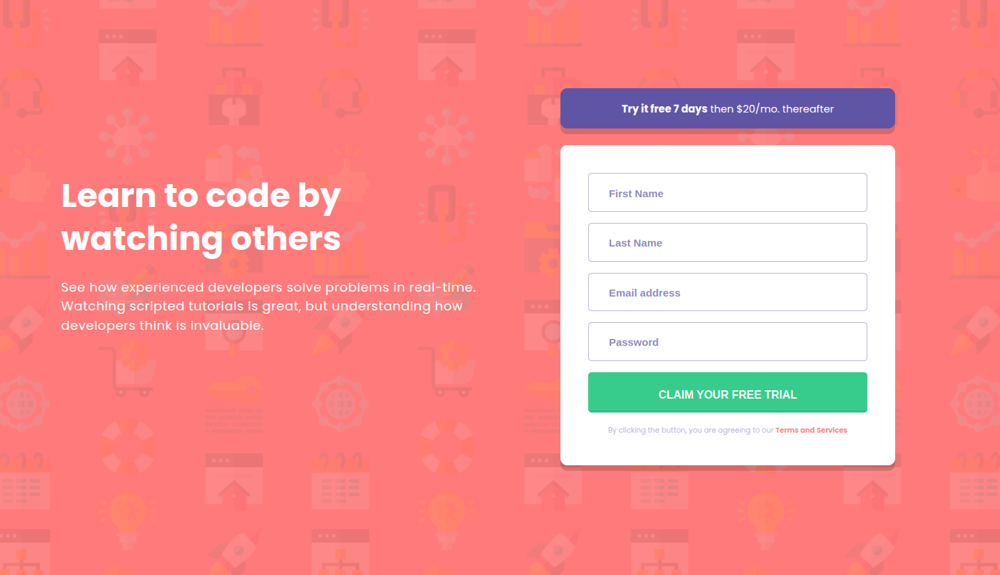
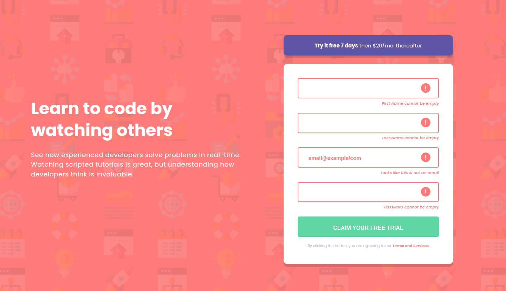
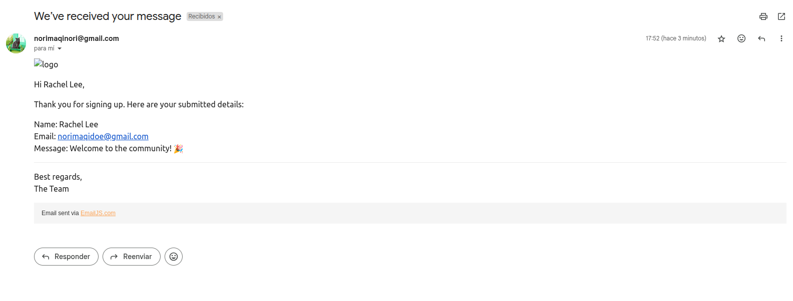
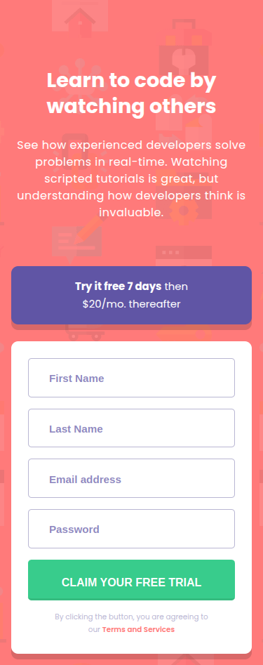

# 🖼 Frontend Mentor - Intro component with sign up form solution

This is a solution to the [Intro component with sign up form challenge on Frontend Mentor](https://www.frontendmentor.io/challenges/intro-component-with-signup-form-5cf91bd49edda32581d28fd1). Frontend Mentor challenges help you improve your coding skills by building realistic projects. 

##  📋 Table of contents

-  Overview

-  Screenshot

-  Links

-  My process

-  Built with

-  Useful resources

- What I learned

-  Author

-  Thanks

##  📖 Overview

In this challenge, participants will practice building a responsive **sign-up form with client-side validation** using **JavaScript**. The objective is to create a landing page that closely matches the provided design. The form should allow users to input their details, providing **real-time feedback and error messages** for any issues.

**Key requirements for the challenge include:**

- Implementing a responsive layout that adjusts based on the user’s device screen size.
- Adding hover and focus states for all interactive elements.
- Validating the form to display error messages if:
  - Any input field is left empty.
  - The email address is incorrectly formatted.
  
To enhance the user experience, a custom email confirmation feature was added using the free plan of EmailJS. This service sends a confirmation message to the email address provided by the user upon successful form submission. While the form does not store or register the submitted data—since it is built entirely on the frontend—this implementation offers clear visual feedback, reassuring users that their information was successfully sent

###  📸 Screenshot

These are the screenshots of the implemented solution:

-  **🖥️ Desktop version**

-  **❌ 👆 Errors & Hover**  

- **📬 Sent mail**

-  **📱 Mobile version**

###  ⛓️ Links

-  src folder: [src](https://github.com/NorimNori/intro-component-singup-form/tree/main/src)

-  components folder: [components](https://github.com/NorimNori/intro-component-singup-form/tree/main/src/components)

-  Live Site URL: [on Netlify](https://new-component-with-singup-form-by-gr.netlify.app/)

##  📌 My process

###  🪚 Built with

-  React.js

-  JavaScript

-  Vite

-  SCSS styles

-  CSS Grid

-  Mobile-first workflow

-  BEM class naming 

-  ARIA (Accesible Rich Internet Applications).

-  Google fonts

-  EmailJS

###  🔬 What I learned

I learned that organizing components into folders with the same name can sometimes make imports a bit confusing. To address this, I implemented an `index.js` file in each folder to simplify and clarify the import process. Additionally, I gained valuable experience in creating **custom hooks** and **handling form validation errors**, which enhanced both the functionality and user experience of the form.

###  📝 Useful resources
-  [JavaScript](https://developer.mozilla.org/es/docs/Web/JavaScript) -  This link leads to the official Mozilla Developer Network (MDN) JavaScript documentation. It offers a comprehensive guide to understanding JavaScript, covering the language's syntax, concepts, and features. The resource is perfect for both beginners and advanced developers who want to dive deeper into JavaScript fundamentals and best practices.

-  [JavaScript Form Validation](https://www.w3schools.com/js/js_validation.asp) -  This link directs to a W3Schools article that explains JavaScript form validation. It provides an easy-to-follow guide on how to validate user input in forms, covering common checks such as ensuring fields are not empty and that email addresses are correctly formatted. The article is in Spanish, but can be easily translated using Google Chrome's translation feature.

-  [EmailJS Tutorial Overview](https://www.emailjs.com/docs/tutorial/overview/) -   This link leads to the EmailJS tutorial overview, which provides step-by-step guidance on how to integrate EmailJS into your JavaScript application. The tutorial explains how to set up an EmailJS account, connect email services, and send emails directly from client-side code without needing a backend. It's a beginner-friendly resource with clear instructions and example code to help you get started quickly. The page is in English, but you can translate it easily using Google Chrome’s translation feature.

##  👋 Author

-  LinkedIn - [Gloria Rangel](https://www.linkedin.com/in/gloria-rangel-06b960306/)

-  Frontend Mentor - [@NorimNori](https://www.frontendmentor.io/profile/NorimNori)

##  🌟 Thank You 🌟

Thanks for visiting this repository! I hope you found it useful and inspiring, or it was just a fun time.

A special thanks to [Frontend Mentor](https://www.frontendmentor.io) for the challenge and for being such an amazing platform to learn and grow as a developer.

Have a nice day! 😊
